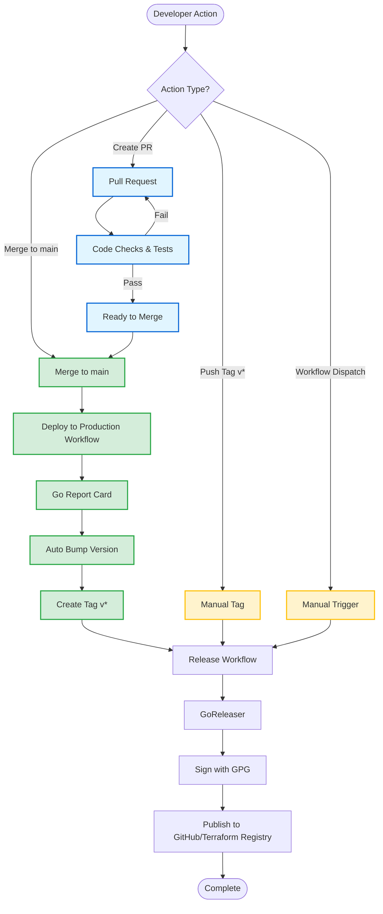

# Terraform Provider Azion - Deployment Process

This flowchart shows the two deployment paths:
1. **Automatic** - Merge to `main` → auto version bump → release
2. **Manual** - Push tag or workflow dispatch → release

## Key Differences

| Path | Trigger | Version Bump | Use Case |
|------|---------|--------------|----------|
| **Automatic** | Merge to `main` | Automatic | Continuous deployment |
| **Manual** | Tag push or dispatch | Manual | Controlled releases |

## Workflows

- **PR Validation**: Code checks, tests, linting
- **Deploy Main**: Auto version bump on merge
- **Release**: GoReleaser with GPG signing
